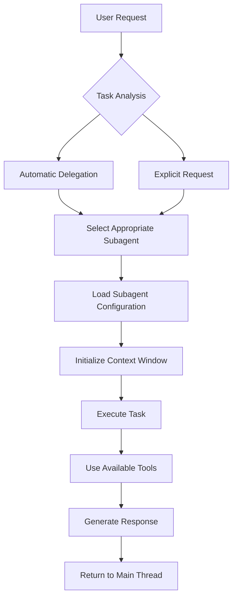
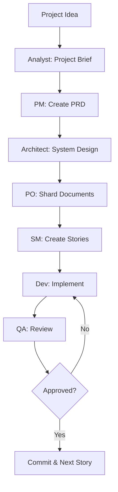

# Claude Code Subagents vs BMAD Method: Comprehensive Analysis and Comparison

## Executive Summary

Claude Code subagents and the BMAD Method represent two fundamentally different approaches to AI-assisted development. Claude Code subagents are a native feature built directly into Anthropic's Claude Code IDE, offering specialized AI assistants with independent context windows and automatic delegation. The BMAD Method is a comprehensive framework that uses prompt engineering and external configuration to create a complete agile development workflow across multiple AI platforms. While both aim to improve development efficiency through specialized AI agents, they differ significantly in implementation, scope, and philosophy.

## Part 1: Claude Code Subagents Deep Dive

### What Are Claude Code Subagents?

Claude Code subagents are specialized AI assistants introduced in version 1.0.60 (July 2025) that can be invoked to handle specific types of tasks within the Claude Code terminal environment. They represent a significant evolution from monolithic AI assistants to collaborative, specialized helpers.

### Core Architecture

#### Native Integration Features
- **Built into Claude Code**: Direct integration with the Claude Code terminal environment
- **Independent Context Windows**: Each subagent operates in its own isolated context space
- **Automatic Delegation**: Claude intelligently routes tasks based on descriptions and context
- **Tool Inheritance**: Subagents can access Claude Code's internal tools and MCP servers
- **Model Selection**: Ability to specify which Claude model (Haiku, Sonnet, Opus) each subagent uses

### Configuration Structure

#### File Location and Format
```markdown
# Project-level subagent: .claude/agents/[agent-name].md
# User-level subagent: ~/.claude/agents/[agent-name].md

---
name: code-reviewer
description: Expert code review specialist. Use proactively for quality checks
tools: Read, Write, Bash, Grep  # Optional - inherits all if omitted
model: sonnet  # Optional - haiku, sonnet, or opus
---

You are a senior code reviewer ensuring high standards of code quality and security.

## Your Responsibilities
- Review code for best practices and patterns
- Identify security vulnerabilities
- Suggest performance optimizations
- Ensure proper error handling
- Check for code duplication

## Review Process
1. Analyze the code structure
2. Check for common anti-patterns
3. Verify security best practices
4. Evaluate performance implications
5. Provide actionable feedback

Always organize feedback by priority:
- Critical (must fix)
- Warnings (should fix)
- Suggestions (nice to have)
```

### How Subagents Work

#### 1. Invocation Methods
```bash
# Automatic invocation based on context
"Review my recent changes"  # Claude detects need for code-reviewer

# Explicit invocation
"Use the code-reviewer subagent to check this function"
"Have the test-runner subagent validate all tests"

# Via /agents command
/agents create "test-runner" "Run tests and fix failures"
/agents list
/agents edit test-runner
/agents delete test-runner
```

#### 2. Lifecycle Flow


#### 3. Context Management
- Each subagent maintains its own context window
- Prevents context pollution in main conversation
- Enables parallel execution (up to 10 concurrent subagents)
- Context isolation ensures focused task execution

### Tool Access and Permissions

#### Internal Tools
```yaml
# Full tool access (default)
tools: # Omitted - inherits all tools

# Specific tool access
tools: Read, Write, Bash, Run, Grep, Glob

# MCP server tools
tools: filesystem, github, jira, slack
```

#### MCP Integration
- Subagents automatically inherit MCP tools from configured servers
- Can be restricted to specific MCP tools
- Enables integration with external services

### Practical Implementation Examples

#### Example 1: Test Automation Subagent
```markdown
---
name: test-runner
description: Use PROACTIVELY to run tests and fix failures
model: sonnet
tools: Read, Write, Run, Bash
---

You are a test automation expert specializing in comprehensive testing.

When you see code changes:
1. Identify relevant test files
2. Run appropriate test suites
3. Analyze any failures
4. Fix failing tests while preserving intent
5. Add new tests for uncovered code

Always maintain >80% code coverage.
Use Jest for JavaScript, pytest for Python.
```

#### Example 2: Database Specialist Subagent
```markdown
---
name: database-admin
description: Database optimization and query specialist
model: opus  # Complex analysis requires more capable model
tools: Read, Write, Bash, postgresql, mysql
---

You are a database administration expert.

Responsibilities:
- Optimize slow queries
- Design efficient schemas
- Set up proper indexing
- Configure replication
- Implement backup strategies

Always consider:
- Query performance
- Data integrity
- Scalability requirements
- Security best practices
```

### Advanced Features

#### 1. Parallel Execution
```bash
# Claude Code can run up to 10 subagents in parallel
"Use 4 tasks in parallel to explore different directories"
```

#### 2. Model-Based Cost Optimization
```yaml
# Low complexity tasks - use Haiku (cheapest)
model: haiku  # Documentation, simple analysis

# Medium complexity - use Sonnet (balanced)
model: sonnet  # Code review, testing

# High complexity - use Opus (most capable)
model: opus  # Architecture design, complex debugging
```

#### 3. Proactive Behavior
```markdown
description: Use PROACTIVELY for continuous monitoring
description: MUST BE USED for all database changes
```

## Part 2: BMAD Method Deep Dive

### What Is the BMAD Method?

The BMAD Method (Breakthrough Method for Agile AI-Driven Development) is a comprehensive framework that transforms AI assistants into a complete agile development team through structured workflows, templates, and prompt engineering.

### Core Philosophy

#### Two-Phase Innovation
1. **Agentic Planning**: Dedicated agents collaborate to create detailed PRDs and Architecture documents
2. **Context-Engineered Development**: Scrum Master transforms plans into hyper-detailed story files

### Implementation Architecture

#### File-Based Configuration
```bash
# BMAD project structure
.bmad-core/
├── agents/           # Agent definitions
│   ├── analyst.md
│   ├── pm.md
│   ├── architect.md
│   ├── dev.md
│   └── qa.md
├── templates/        # Document templates
│   ├── prd-tmpl.yaml
│   ├── story-tmpl.yaml
│   └── architecture-tmpl.yaml
├── tasks/           # Repeatable tasks
│   ├── create-next-story.md
│   └── shard-doc.md
├── checklists/      # Quality checklists
└── core-config.yaml # Core configuration
```

#### Agent Definition Structure
```yaml
# .bmad-core/agents/dev.md
agent:
  name: Dev
  role: Senior Full-Stack Developer
  style: Professional, detail-oriented
  focus:
    - Implementation with architectural alignment
    - Test-driven development
    - Performance optimization
  
dependencies:
  templates:
    - code-review-template
    - test-strategy
  tasks:
    - implement-story
    - run-tests
  checklists:
    - dev-checklist
  data:
    - technical-preferences.md

commands:
  - name: implement
    description: Implement a story
  - name: test
    description: Run and fix tests
  - name: debug
    description: Debug issues

startup_instructions: |
  Load current story file
  Review architectural context
  Check coding standards
```

### How BMAD Agents Work

#### 1. Agent Invocation
```bash
# Web UI (Gemini, ChatGPT, Claude)
*analyst        # Start with analyst
*agent pm       # Switch to PM agent
*agent architect # Switch to architect

# IDE (Cursor, Claude Code, Windsurf)
@sm Create next story for Epic 1
@dev Implement story 1.3
@qa Review completed implementation
```

#### 2. Workflow Orchestration


#### 3. Context Management Through Documents
```yaml
# Story file with embedded context
# docs/stories/1.3.story.md
---
status: In Progress
assigned: Dev Agent
epic: User Authentication
---

## Story Details
As a user, I want to log in securely...

## Context from Architecture
[Complete architectural context embedded]

## Implementation Details
[Specific technical requirements]

## Tasks
- [ ] Implement login endpoint
- [ ] Add input validation
- [ ] Write unit tests
```

### Platform Compatibility

#### Multi-Platform Support
- **Web Platforms**: Gemini, ChatGPT, Claude, Perplexity
- **IDEs**: Cursor, Claude Code, Windsurf, VS Code
- **Local Models**: Ollama, LM Studio
- **APIs**: OpenAI, Anthropic, Google

#### Bundle Distribution
```bash
# Single file containing all agents
dist/teams/team-fullstack.txt

# Upload to any AI platform with instructions:
"Your critical operating instructions are attached, 
 do not break character as directed"
```

## Part 3: Comprehensive Comparison

### Implementation Philosophy

| Aspect | Claude Code Subagents | BMAD Method |
|--------|----------------------|-------------|
| **Architecture** | Native IDE feature | External framework |
| **Configuration** | Markdown with YAML frontmatter | YAML/Markdown templates |
| **Platform** | Claude Code only | Platform-agnostic |
| **Context Management** | Independent context windows | Document-based context |
| **Agent Communication** | Direct delegation | File-based handoffs |
| **Workflow** | Task-specific assistance | Complete agile methodology |

### Technical Differences

#### 1. Agent Definition

**Claude Code Subagent:**
```markdown
---
name: simple-agent
description: One-line description
tools: tool1, tool2
model: sonnet
---
System prompt here
```

**BMAD Agent:**
```yaml
agent:
  name: Complex Agent
  role: Detailed role description
  style: Communication style
  focus: [multiple, focus, areas]
dependencies:
  templates: [list]
  tasks: [list]
  checklists: [list]
commands:
  - name: command1
    description: detailed description
startup_instructions: |
  Multi-line initialization
```

#### 2. Invocation Methods

**Claude Code:**
- Automatic based on context
- Explicit via natural language
- `/agents` command interface
- Parallel execution support

**BMAD:**
- Manual agent switching (`*agent`)
- IDE-specific patterns (`@agent`)
- Orchestrator coordination
- Sequential workflow focus

#### 3. Context Handling

**Claude Code:**
- Isolated context windows per subagent
- No context sharing between subagents
- Automatic context management
- Up to 10 parallel contexts

**BMAD:**
- Shared context through documents
- Story files contain full context
- Manual context management
- Sequential context passing

### Use Case Comparison

#### When to Use Claude Code Subagents

**Ideal for:**
- Claude Code users wanting specialized assistance
- Tasks requiring parallel execution
- Projects needing isolated context management
- Cost optimization through model selection
- Quick, focused task delegation

**Example Scenarios:**
```bash
# Parallel code exploration
"Explore the codebase using 4 parallel tasks"

# Specialized review
"Have security-auditor check for vulnerabilities"

# Automated testing
"Use test-runner to validate all changes"
```

#### When to Use BMAD Method

**Ideal for:**
- Complete project lifecycle management
- Teams needing structured agile workflow
- Multi-platform AI usage
- Complex projects requiring documentation
- Organizations with specific methodologies

**Example Scenarios:**
```bash
# Full project development
*analyst → *pm → *architect → @sm → @dev → @qa

# Brownfield enhancement
Analyze existing → Create feature PRD → Update architecture

# Team collaboration
Shared PRDs, architectures, and story files
```

### Integration Possibilities

#### Hybrid Approach

```markdown
# Use BMAD methodology with Claude Code subagents

## Phase 1: BMAD Planning (Web UI)
- Use BMAD agents for PRD/Architecture creation
- Generate comprehensive documentation

## Phase 2: Claude Code Implementation
- Create subagents based on BMAD agent definitions
- Implement BMAD stories using Claude Code subagents
- Maintain BMAD document structure

## Example Integration:
---
name: bmad-dev
description: BMAD Developer Agent for story implementation
tools: Read, Write, Run, Test
---
You follow BMAD methodology for development.
Always reference story files in docs/stories/
Follow architecture in docs/architecture/
Update story status after completion.
```

#### Migration Path

```bash
# Converting BMAD agents to Claude Code subagents

# 1. Extract agent definition
cat .bmad-core/agents/dev.md

# 2. Create Claude Code subagent
mkdir -p .claude/agents
echo '---
name: bmad-dev
description: BMAD Developer Agent
tools: Read, Write, Run, Bash
---
[Paste BMAD agent instructions]
' > .claude/agents/bmad-dev.md

# 3. Adapt workflows
# Replace @dev with subagent invocation
"Use bmad-dev to implement story 1.3"
```

### Advantages and Limitations

#### Claude Code Subagents

**Advantages:**
- Native integration with Claude Code
- Automatic task delegation
- Independent context windows
- Parallel execution capability
- Model-based cost optimization
- No external configuration needed
- Seamless tool integration

**Limitations:**
- Claude Code exclusive
- Limited to Claude models
- No built-in agile methodology
- Less structured workflow
- No cross-platform support
- Requires Claude Code subscription

#### BMAD Method

**Advantages:**
- Platform agnostic
- Complete agile methodology
- Structured document flow
- Comprehensive templates
- Team collaboration support
- Extensible through expansion packs
- Works with any AI model

**Limitations:**
- Manual agent switching
- No parallel execution
- Context loss between agents
- Steeper learning curve
- Requires external setup
- More complex configuration

## Part 4: Future Developments and Recommendations

### Emerging Trends

#### Claude Code Evolution
- Expanding subagent capabilities
- Better automatic delegation
- Enhanced MCP integration
- Improved parallel processing
- Cross-project agent sharing

#### BMAD Evolution
- Claude Code subagent integration (PR #359)
- Automated orchestration improvements
- Feature-driven development support
- Better context preservation
- Enhanced expansion packs

### Recommendations by Use Case

#### For Individual Developers
- **Simple Projects**: Claude Code subagents
- **Complex Projects**: BMAD for planning, subagents for implementation
- **Learning Curve**: Start with subagents, adopt BMAD gradually

#### For Teams
- **Small Teams**: Claude Code subagents with shared agent library
- **Large Teams**: BMAD for standardization and documentation
- **Enterprise**: Hybrid approach with custom integration

#### For Specific Domains
- **Web Development**: Both work well, choose based on team preference
- **Data Science**: Claude Code subagents for parallel analysis
- **DevOps**: BMAD for infrastructure planning, subagents for implementation
- **Creative Work**: BMAD expansion packs offer better support

### Best Practices for Implementation

#### Starting with Claude Code Subagents
1. Begin with 2-3 essential subagents
2. Use automatic delegation initially
3. Add specialized subagents as needed
4. Optimize model selection for cost
5. Share successful agents with team

#### Starting with BMAD Method
1. Complete planning phase first
2. Use orchestrator for guidance
3. Customize templates gradually
4. Document technical preferences
5. Iterate on agent definitions

#### Hybrid Implementation
1. Use BMAD for project structure
2. Create Claude Code subagents for each BMAD role
3. Maintain BMAD document standards
4. Leverage subagent parallelism
5. Combine strengths of both systems

## Conclusion

Claude Code subagents and the BMAD Method represent complementary approaches to AI-assisted development. Claude Code subagents excel at providing specialized, parallel assistance within the Claude Code environment, while BMAD offers a comprehensive agile framework that works across platforms.

The choice between them depends on your specific needs:
- Choose **Claude Code subagents** for native integration, parallel execution, and focused task assistance
- Choose **BMAD Method** for complete project lifecycle management, platform flexibility, and structured workflows
- Consider a **hybrid approach** to leverage the strengths of both systems

As AI-assisted development continues to evolve, both approaches will likely converge, with BMAD potentially adopting native Claude Code features and Claude Code incorporating more structured methodologies. The future of development lies not in choosing one over the other, but in understanding how to effectively leverage both paradigms to maximize productivity and code quality.